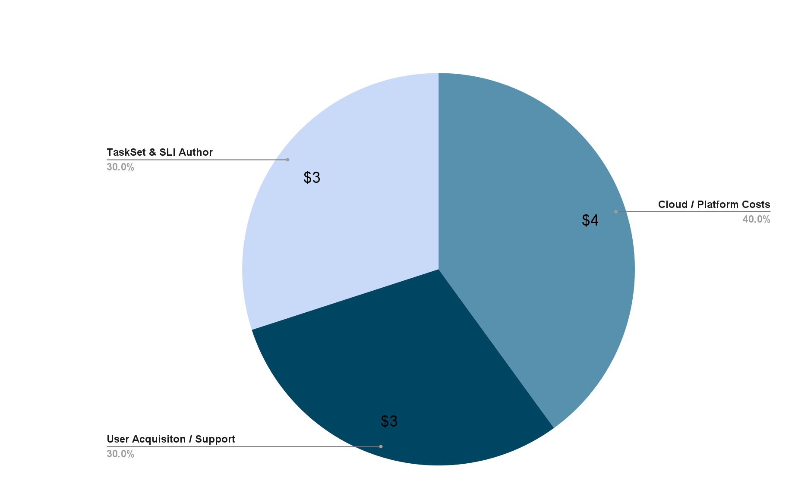

# Author Rewards
Below you'll find details on the various rewards associated with being a CodeCollection author in our community!

## Bounties
While the royalty payments are the primary focus of the Code Collection Authors program, from time to time the RunWhen team may offer one-time "bounty" bonuses in return for specific code bundles built to our specifications and on our client’s timeframes, e.g. "can anyone build an SLI and TaskSet for AWS SQS next week?"

To take a bounty, go have a look through our [issues](https://github.com/runwhen-contrib/codecollection-authors/issues) marked with the `has bounty` label and assign yourself to the issue (provided it has no other assignees). Bounty size generally related to the priority labels, indicating that a client may need it asap.

## Royalties
The baseline structure of RunWhen’s pricing model is that paid workspaces cost ~$10/SLX/month.  From there, we may apply various discounts that lower the per-SLX price, or enterprise workspace add-ons.

Out of the base rate of $10/SLX/month, approximately $2/month goes to the author of the TaskSet Code Bundle and $1/month goes to the author of the SLI Code Bundle when they are part of this program. ($4/month goes to RunWhen’s cloud and platform operational costs and $3/month goes to the cost of acquiring new users and supporting existing users.)

It is our assumption that a typical small/mid size enterprise with a single team using the RunWhen platform is expected to have 50-100 SLXs per Workspace at reasonable maturity.  A large enterprise with multiple teams may have 5-10x that amount.

Note that the royalty payments for Code Bundle authors will drift from the Code Bundle statistics page as royalty payments occur when they are being used in paid workspaces, not in free tier workspaces, and the actual amount available to authors may be less than the $3/SLX/month due to enterprise discounts determined during vendor negotiations. At the time of this writing, we do not yet have good visibility into exactly where this will land as we expect to react to market conditions through 2023.

## Promotion Of Work
From time to time, members of the RunWhen team may check your interest in jointly promoting your Code Collection and the RunWhen platform.  If you are interested, this may include activities like:
- Joint blog and/or LinkedIn posts
- In depth Medium articles
- Press releases and press interviews
- Joint webinars
- Public async conversations on our slack channel
- Profile spotlighting of top contributors 
- Annual rankings of code bundle popularity with embedded links to promote authors other contributions

## SWAG
We're currently looking at getting swag designed to share with the community. If you'd like some asap just reach out to us!
